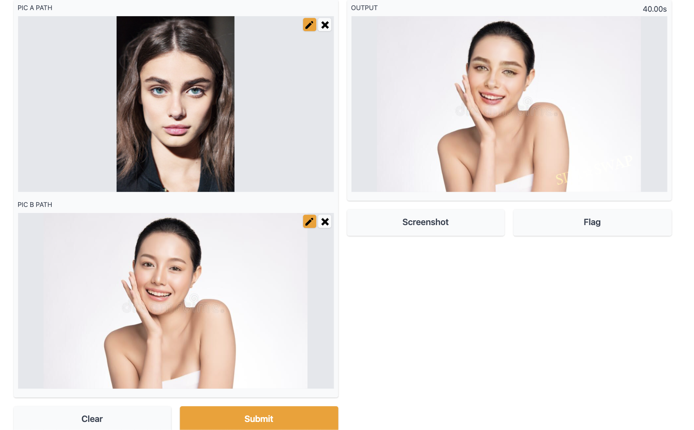
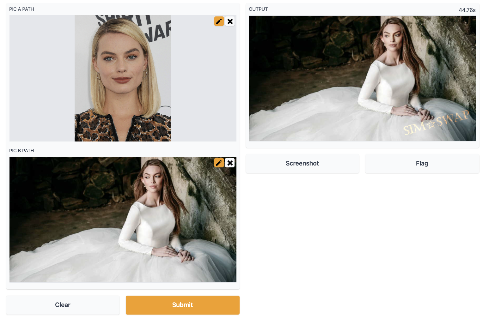

# SimSwap: An Efficient Framework For High Fidelity Face Swapping

[](https://github.com/neuralchen/SimSwap)

This project is forked from the [official SimSwap repository](https://github.com/neuralchen/SimSwap/) and integrates a UI for user-friendly inference using Gradio.


# Installation 

 - Make sure you have an NVIDIA driver installed. I used an Azure ML VM which hosts 1 x NVIDIA Tesla K80. The inference time for swapping two images was around 40-50s. 


- Follow the [original README](./README_orig.md) to set up Pytorch/the SimSwap conda environment. For more information see the original [preparation guide](https://github.com/vccheng2001/SimSwap/blob/main/docs/guidance/preparation.md) and [inference guide](https://github.com/vccheng2001/SimSwap/blob/main/docs/guidance/usage.md).

- For the UI, you will need to install [Gradio](https://gradio.app/) within the virtual environment. 

``` bash
conda activate simswap
pip install gradio 
```


# Inference with UI:

## Swap Image (Single)
To transform pic A's face onto pic B:

```bash
  cd SimSwap
  python test_ui_wholeimage_swapsingle.py    
  ```


# Examples



